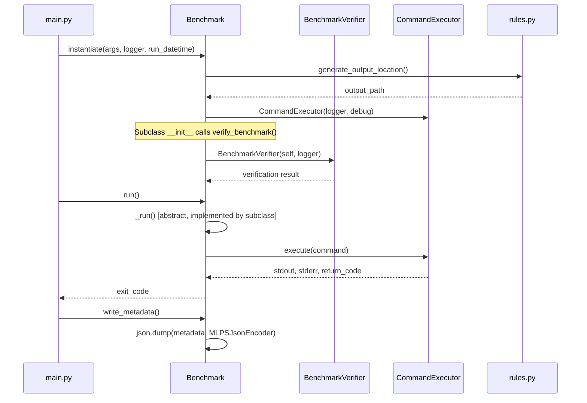

# Benchmark Class Dependency Diagram

This document provides a high-level view of the `Benchmark` class and its dependency tree in the MLPerf Storage benchmark suite.

## Class Hierarchy Diagram

```mermaid
flowchart TB
    subgraph Callers["Classes that CALL Benchmark"]
        main["main.py<br/>run_benchmark()"]
    end

    subgraph BenchmarkHierarchy["Benchmark Class Hierarchy"]
        Benchmark["Benchmark<br/>(Abstract Base Class)<br/>benchmarks/base.py:22"]
        DLIOBenchmark["DLIOBenchmark<br/>(Abstract)<br/>benchmarks/dlio.py:15"]
        TrainingBenchmark["TrainingBenchmark<br/>benchmarks/dlio.py:122"]
        CheckpointingBenchmark["CheckpointingBenchmark<br/>benchmarks/dlio.py:246"]
        VectorDBBenchmark["VectorDBBenchmark<br/>benchmarks/vectordbbench.py:9"]

        Benchmark --> DLIOBenchmark
        Benchmark --> VectorDBBenchmark
        DLIOBenchmark --> TrainingBenchmark
        DLIOBenchmark --> CheckpointingBenchmark
    end

    subgraph Dependencies["Classes that Benchmark CALLS"]
        BenchmarkVerifier["BenchmarkVerifier<br/>rules.py:765"]
        CommandExecutor["CommandExecutor<br/>utils.py:159"]
        MLPSJsonEncoder["MLPSJsonEncoder<br/>utils.py:23"]
        generate_output["generate_output_location()<br/>rules.py:948"]
        setup_logging["setup_logging()<br/>mlps_logging.py"]
        apply_logging["apply_logging_options()<br/>mlps_logging.py"]
    end

    subgraph Config["Configuration Dependencies"]
        config["config.py<br/>PARAM_VALIDATION<br/>DATETIME_STR<br/>MLPS_DEBUG"]
    end

    subgraph External["External Dependencies"]
        pyarrow["pyarrow.ipc<br/>open_stream"]
        abc["abc<br/>ABC, abstractmethod"]
    end

    main -->|"instantiates"| TrainingBenchmark
    main -->|"instantiates"| CheckpointingBenchmark
    main -->|"instantiates"| VectorDBBenchmark

    Benchmark -->|"uses"| BenchmarkVerifier
    Benchmark -->|"uses"| CommandExecutor
    Benchmark -->|"uses"| MLPSJsonEncoder
    Benchmark -->|"uses"| generate_output
    Benchmark -->|"uses"| setup_logging
    Benchmark -->|"uses"| apply_logging
    Benchmark -->|"imports"| config
    Benchmark -->|"imports"| pyarrow
    Benchmark -->|"inherits"| abc
```



## Detailed Dependency Analysis

### Classes That Call Benchmark

| Caller | File | Line | Description |
|--------|------|------|-------------|
| `run_benchmark()` | `mlpstorage/main.py` | 34-60 | Entry point that instantiates and runs benchmark subclasses |

### Benchmark Class (Abstract Base)

**Location:** `mlpstorage/benchmarks/base.py:22`

**Key Methods:**
| Method | Line | Purpose |
|--------|------|---------|
| `__init__()` | 26 | Initialize benchmark with args, logger, runtime tracking |
| `_execute_command()` | 56 | Execute shell commands via CommandExecutor |
| `metadata` (property) | 100 | Return instance attributes for serialization |
| `write_metadata()` | 111 | Write metadata JSON to output file |
| `generate_output_location()` | 118 | Generate standardized output directory path |
| `verify_benchmark()` | 123 | Validate benchmark parameters using BenchmarkVerifier |
| `_run()` | 159 | Abstract method - must be implemented by subclasses |
| `run()` | 167 | Public entry point - measures execution time and calls _run() |

### Benchmark Subclasses

| Subclass | File | Line | BENCHMARK_TYPE |
|----------|------|------|----------------|
| `DLIOBenchmark` | `benchmarks/dlio.py` | 15 | (abstract) |
| `TrainingBenchmark` | `benchmarks/dlio.py` | 122 | `BENCHMARK_TYPES.training` |
| `CheckpointingBenchmark` | `benchmarks/dlio.py` | 246 | `BENCHMARK_TYPES.checkpointing` |
| `VectorDBBenchmark` | `benchmarks/vectordbbench.py` | 9 | `BENCHMARK_TYPES.vector_database` |

### Dependencies That Benchmark Calls

| Dependency | File | Line | Usage in Benchmark |
|------------|------|------|-------------------|
| `BenchmarkVerifier` | `rules.py` | 765 | Validates benchmark parameters (line 126) |
| `CommandExecutor` | `utils.py` | 159 | Executes shell commands (line 45) |
| `MLPSJsonEncoder` | `utils.py` | 23 | JSON serialization for metadata (line 113) |
| `generate_output_location()` | `rules.py` | 948 | Generates output directory path (line 121) |
| `setup_logging()` | `mlps_logging.py` | - | Creates logger if not provided (line 33) |
| `apply_logging_options()` | `mlps_logging.py` | - | Applies logging settings (line 35) |
| `debug_tryer_wrapper` | `debug.py` | - | Debug utilities (imported) |

### Configuration Imports

| Import | Source | Usage |
|--------|--------|-------|
| `PARAM_VALIDATION` | `config.py` | Validation state enum |
| `DATETIME_STR` | `config.py` | Default datetime string |
| `MLPS_DEBUG` | `config.py` | Debug mode flag |

## Data Flow Diagram



## File Structure

```
mlpstorage/
├── main.py                    # Entry point - calls Benchmark
├── benchmarks/
│   ├── __init__.py            # Exports benchmark classes
│   ├── base.py                # Benchmark abstract base class
│   ├── dlio.py                # DLIOBenchmark, TrainingBenchmark, CheckpointingBenchmark
│   └── vectordbbench.py       # VectorDBBenchmark
├── rules.py                   # BenchmarkVerifier, generate_output_location()
├── utils.py                   # CommandExecutor, MLPSJsonEncoder
├── config.py                  # Configuration constants
├── mlps_logging.py            # Logging utilities
└── debug.py                   # Debug utilities
```
